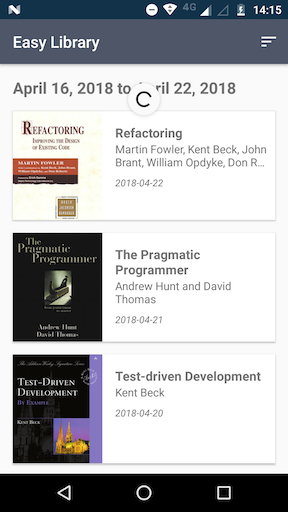
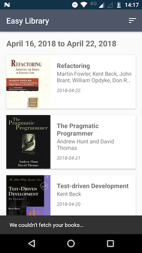

# Easy Library

>Download the APK here: [soon]

Ever needed a simplified version of Blinkist's library view that allows you to browse your books in a convenient way? This is it! Except the list of books is made up and all the published dates are wrong.

## Screenshots
  

## Technologies

I chose my favorite technologies to work with when it comes to Android development:

- [Kotlin](https://kotlinlang.org/)
- [Architecture Components](https://developer.android.com/topic/libraries/architecture/)
- [Dagger](https://google.github.io/dagger/)
- [RxJava](https://github.com/ReactiveX/RxJava)
- [Retrofit](http://square.github.io/retrofit/)
- [Glide](https://github.com/bumptech/glide)
- [Timber](https://github.com/JakeWharton/timber)

And I added [RESTMock](https://github.com/andrzejchm/RESTMock) for the mock API.

## Data

All my decisions towards how to handle the data were made based on my needs and opinion as an user:

- I want to be able to interact with the app as soon as possible (UI should be unblocked as soon as local persistence responds)
- I want to be able to sync the data with the server anytime I want (pull to refresh)
- The data must be up to date if I just opened the app
- Orientation changes must not trigger data syncs
- If a sync fails, I want to know about it so I'm aware the data I'm looking at might not be up to date
- I want to be aware of when the app is fetching data from the server (non-blocking UX loading state - pull to refresh again)
- If the data updates while I'm interacting with it, my interaction shouldn't be interfered (e.g. losing scroll state or blinking the whole list to add a new item should be avoided)

I wrote the data code with the goal of achieving every single item from this list - that and building a testable architecture were the two guiding principles for most of the code in the app.
